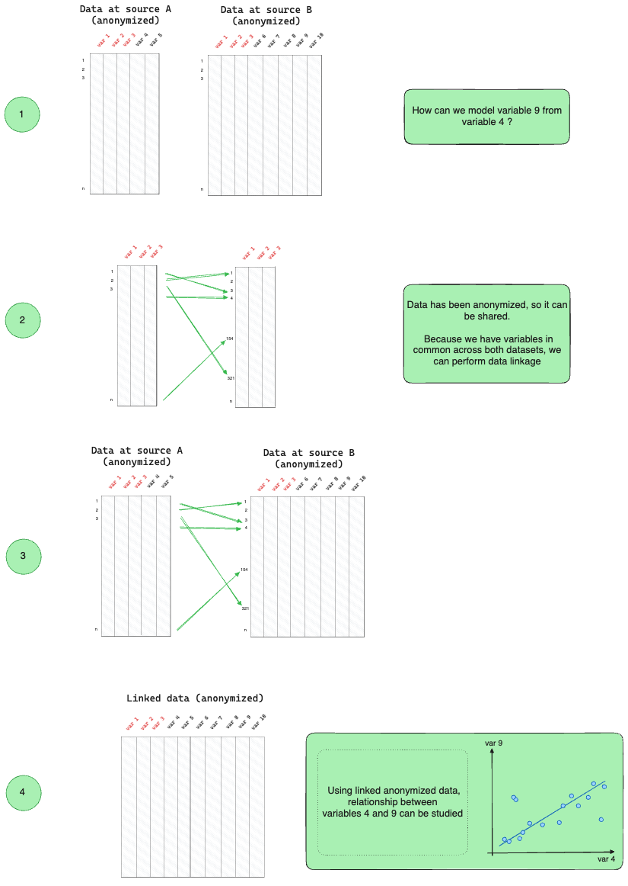

# Overview

Data linkage aims to associate individuals from a data source A are to individuals from a data source B in a way that global statistics on $A \cup B$ can be discovered and exploited.

Although the library can be used on any data, the original need for data linkage functionalities comes from a context where data at each source cannot be shared for legal or competition reasons. Data linkage should therefore be compatible with anonymized data.

## Example

## Scope

The library currently focuses on linkage in the following contexts: 
- **There must be some variables in common**. The solutions made available use a notion of distance between individuals in both sources. This distance is computed using those common variables. 
- **Both sources contain data on the same individuals**.  Linkage algorithms can be adapted to handle linkage of different populations but this is not currently done and evaluation on such contexts has not been carried out to date.
- Evaluation of the proposed linkage solutions has been carried out on contexts with **only 2 data sources**. While handling more data sources by sequentially applying linkage is possible, there is no evidence on the quality of the resulting linked data.
- Data to be linked is **contained in a single file at each source** where one row represents one individual to link. Relational databases are not handled. 

## Linkage steps

Data linkage should follow some key steps. First, in most contexts data will need to be anonymized, so that it can be shared before being linked. It is then necessary to evaluate the potential for linkage. If the variables common to both datasets are too few or not representative enough of the datasets, then success of linkage cannot be guaranteed and it is recommended to look for additional or alternative common variables before proceeding with linkage. Pre-linkage metrics are available to measure the chances for a linkage to be successful. Following computation of pre-linkage metrics, linkage can be performed, resulting in a single linked data file. When possible (i.e. in experimental or development contexts), post-linkage metrics can be computed to compare a reference dataset to the linked data.

Those steps and insights about linkage performance are detailed in dedicated pages:
- [Anonymization](./anonymization_privacy.md)
- [Pre-linkage metrics](./prelinkage_metrics.md)
- [Linkage](./linkage_methods.md)
- [Post-linkage metrics](./postlinkage_metrics.md)
- [Experiments](./experiments.md)
