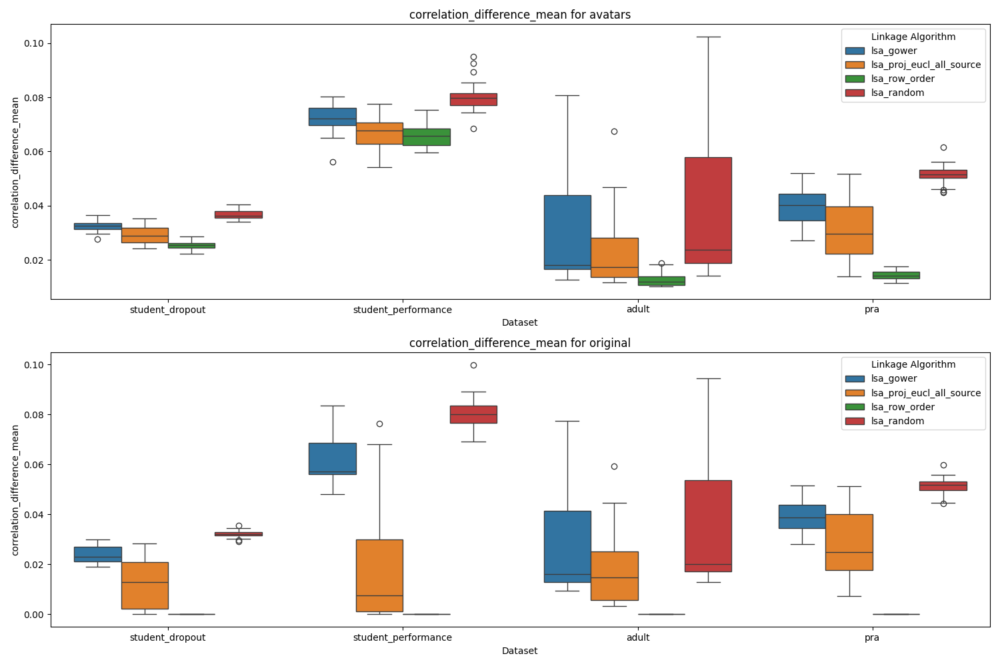
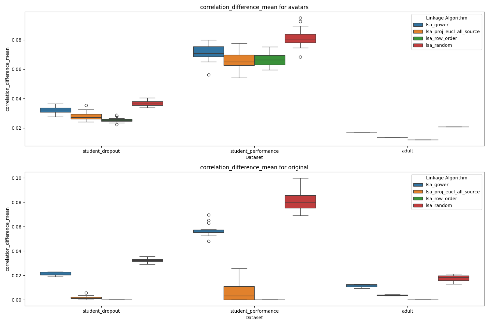
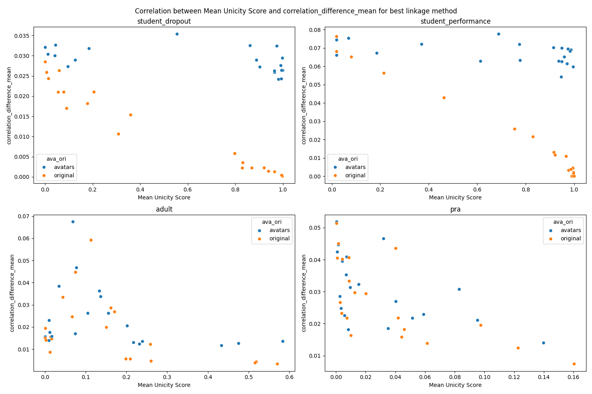
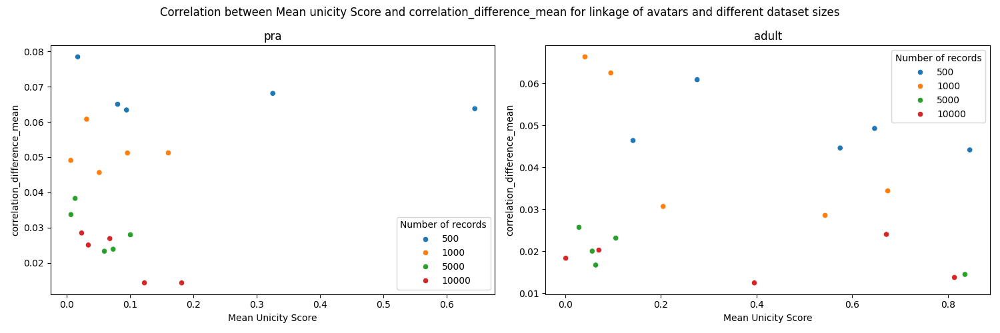
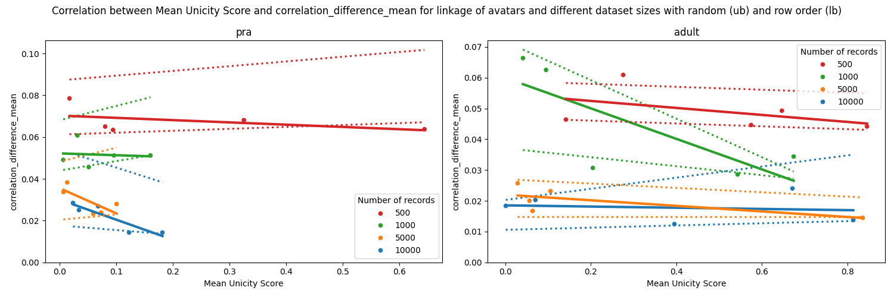

# Experimental results

## Differences between the selected datasets

#### Dataset sizes
The number of rows in a dataset is a property which may be important when interpreting results because it probably has an impact on linkage. This is especially true because the proposed linkage solutions are approximative: the aim of the linkage is not to link individual 1 from source A with individual 1 from source B but instead to link individual 1 from source A with another individual from source B in such way that the global statistical properties of the datasets are preserved.

We can expect that 
- linkage on a few individuals is less tolerant to approximation: for linkage of a given individual at source A, there are less candidate at source B than on datasets with a lot of individuals. 
- Also, a proper anonymization method (such as avatar) will modify to a greater extent individuals from a small dataset than from a large dataset (i.e. many individuals).
- **It is expected that linkage of larger datasets (in terms of number of individuals) should preserve better the global statistical properties.**

| Dataset    | Number of individuals |
| ---------- | --------------------- |
| student performance      | 395    |
| student dropout | 4424     |
| adult    | 10000 (out of 48842)    |
| pra    | 12430    |

#### Unicity scores

Based on the variables present in each datasets and in particular their cardinality, the unicity scores differ across datasets.

**Interpretation:**
- linkage on student_dropout and student_performance datasets are expected to result in better quality linked data based on unicity score only. 
- However, they are also the datasets with the fewest individuals (this should impact linkage of avatars)

## Results

#### Correlation differences

**Interpretation:**
- Across all datasets, *lsa + euclidean distance in a projected space* is the method giving the best results (i.e. correlation difference is the lowest)

#### Correlation differences (for high unicity scores only)

**Interpretation:**
- When the unicity score is high (e.g. > 0.5), the linkage with the best method is of similar or comparable quality to *row_order*. It can even outperform it

## Can we predict post-linkage results from pre-linkage metrics ?

#### Correlation between Unicity score (pre-metric) and correlation difference (post-metric)

**Interpretation:**
- The trend (correlation) between pre and post linkage metrics is clear when linking subsets of the original data
- The correlation can be observed on avatar linkage on adult and pra.
- 

#### Correlation between Contribution score (pre-metric) and correlation difference (post-metric)

**Interpretation:**
- No systematic clear correlation with post-linkage metric when using this contribution score. Focusing on pra and adult where a correlation is observed on unicity score, we see that this is not the case here.

#### Impact of dataset size on linkage of avatars

**Interpretation:**
- The more records, the closer from original.

## Take-home messages

- Unicity score should be combined with number of records to decide whether linkage could be performed

## Questions we should answer

- What is the best pre-linkage metric ? 
    it seems that this will be unicity score
- In the case where that best linkage metric (e.g. unicity score) is not good for a scenario, is there another metric that can be used ?
    e.g. can shared variables that are non unique but that are representative of the data structure (i.e. good contribution score) be used for linkage?